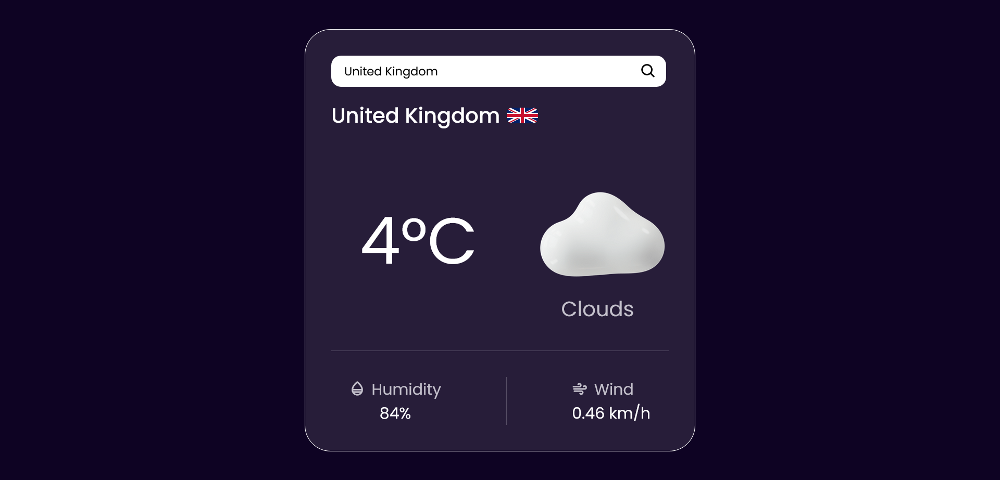

# Weather App Project

Discover real-time weather updates for any country with our easy-to-use Weather App.

## Table of contents

- [Overview](#overview)
  - [The challenge](#the-challenge)
  - [Screenshot](#screenshot)
  - [Links](#links)
- [My process](#my-process)
  - [Built with](#built-with)
- [Author](#author)

## Overview

### The challenge

Users should be able to:

- Enter location
- Get simple weather data based on location

### Screenshot

### Links

- Live Site URL: [https://quiel-pp-weather-app.netlify.app/](https://quiel-pp-weather-app.netlify.app/)

## My process

### Built with

- HTML5
- Sass
- JavaScript

## Author

- GitHub - [quielLovesLasagna](https://github.com/quielLovesLasagna)
